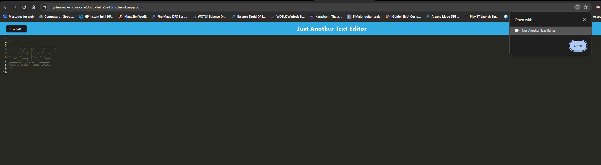

# Not_Another_Text_Edited

## Description
A simple text editor PWA

## Table of Contents

[Installation](#installation)

[How to Use](#how_to_use)

[Contributors](#contributors)

[Tests](#tests)

[License](#license)

## Installation

To install this application jsut clone the Github repo.

## How to Use

To use this application make sure you are in the root file and use the start:dev script

## Contributors

This application uses the following packages:
1. express
2. nodemon
3. babel-loader
4. css-loader
5. codepack-mirir-themes
6. idb
7. webapck

## Tests

Currently there is no testing for this application

## License 

## Contact

MEdelsteinE@github.com

https://mysterious-wildwood-29093-4ef425e190fc.herokuapp.com/

